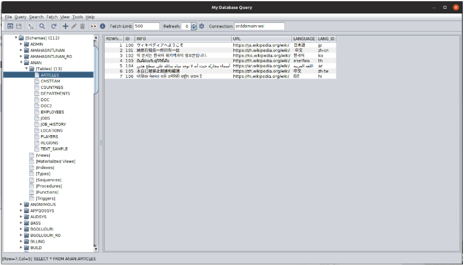

# MyQuery2 v2.0 MVP — JDBC Desktop Database Query Tool



**MyQuery2** ("My Database Query App") is a desktop SQL client written in Java Swing using JDBC drivers. It allows users to configure and persist connections to multiple databases — Oracle, PostgreSQL, SDB, and MySQL — whether local or remote. Users can write SQL queries manually or use the built-in UI to generate statements. They can explore database objects (tables, views, indexes, etc.), perform related tasks, and import or export table definitions and data across the same or different databases. Administrators can monitor database information such as locks, long-running queries, and CPU/memory/disk usage (Oracle only), and can terminate rogue queries that monopolize system resources.

**MVP (Minimum Viable Product) edition** — subset of features for essential database work.

## What's in this package

| File | Description |
|------|-------------|
| `myquery.jar` | Application JAR |
| `myquery2.sh` | Linux/Mac launcher |
| `myquery2.bat` | Windows launcher |
| `myquery.xml` | Application config (JDBC drivers) |
| `myquery.ini` | JAVA_HOME config |
| `log4j2.xml` | Logging config |
| `jdbc/` | JDBC driver jars (PostgreSQL, MySQL) |
| `misc/` | Runtime dependency jars (Tika, Log4j, Gson, Guava) |

## Requirements

- JDK 17+
- A supported database server (Oracle, PostgreSQL, MySQL, SDB)

## Quick start

```bash
# Linux/macOS
./myquery2.sh

# Windows
.\myquery2.bat
```

If `java` is not on your PATH, set `JAVA_HOME` in `myquery.ini`.

## MVP Features

This MVP build includes:
- JDBC connections to Oracle, PostgreSQL, MySQL, SDB
- SQL query editor with multi-statement support
- Paginated query results
- Export to XML, CSV, HTML
- Schema/Tables/Views navigation
- Basic CRUD (Insert/Update/Delete) on query results
- Content/Attributes/DDL views
- Tablespace/Role/User browsing
- Disk usage charts

## Disabled features (MVP)

The following features are disabled in this MVP edition:
- Detect Encoding (files)
- Explain Plan / Execution Plan
- Long Running Queries
- Lock Info
- List Statistics
- Bind Variables
- Import / Export / Transform
- Detect / Translate / Dump / Inspect Content
- Content View / Document View / Download
- Monitor

For full feature access, use the standard [MyQuery2-mvn-releases](https://github.com/amahasintunan/MyQuery2-mvn-releases) edition.
